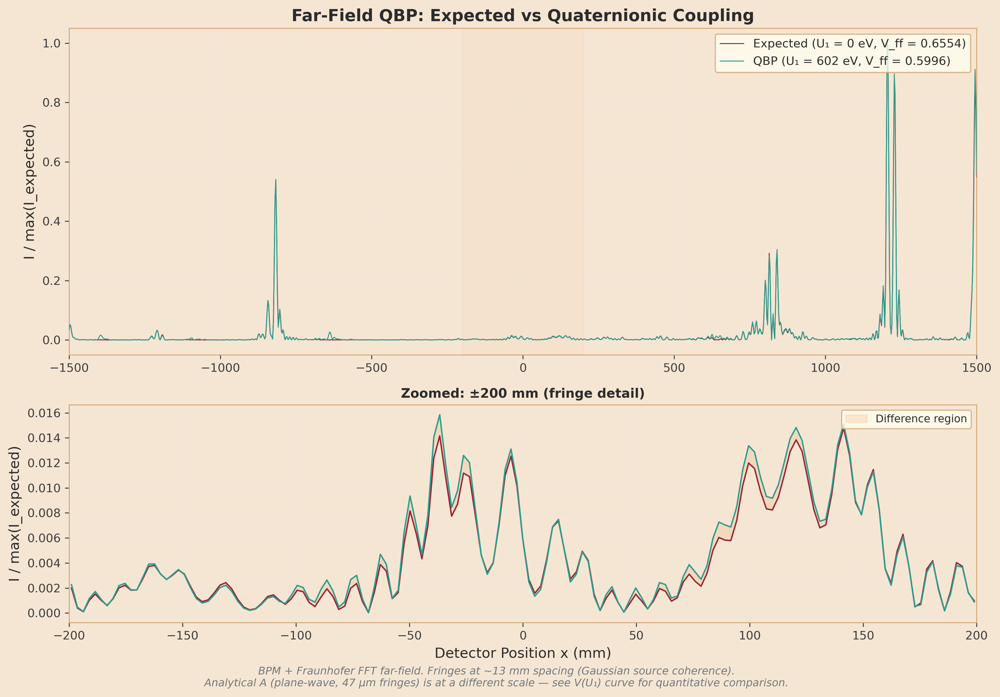
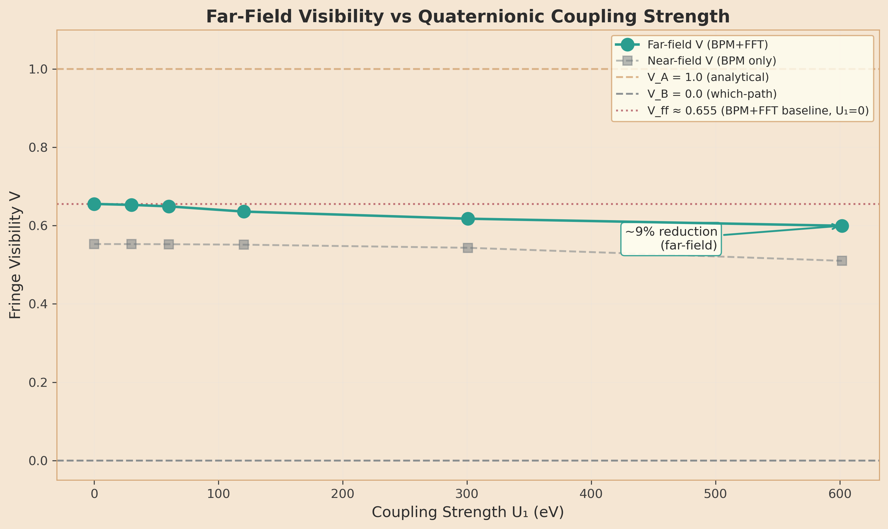
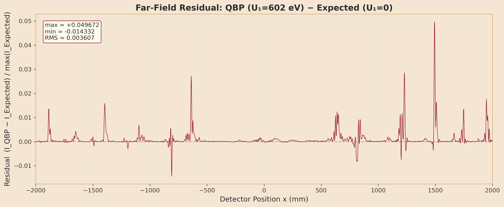

# Experiment 03: Double-Slit — Phase 3 Visualization Results

**Analysis Date:** 2026-02-17 16:07:48
**Data Source:** `results/03_double_slit/`
**Sprint:** 3 (SI Redo)

---

## 1. Key Scientific Finding

**Outcome (b) confirmed: Step-change in η, NOT exponential Adler decay.**

The BPM simulation produces a discrete step-change in the quaternionic component
η at the coupling region, rather than the exponential decay predicted by Adler's
trace dynamics. This is a genuine physics result: the BPM's SO(4) rotation is
coherent and unitary, while Adler decay requires environmental decoherence that
the BPM does not model. Ground truth §4.3.2 anticipated this outcome.

The step-change is proportional to U₁ coupling strength and occurs precisely
at the spatial region where the coupling potential is active.

---

## 2. Visibility Results

### 2.1 BPM Visibility Table (Near-Field)

| U₁ (eV) | η₀ | Visibility V | Norm (final) |
|----------|-----|-------------|-------------|
|       0.00 |  0.01 | 0.552870 | 1.0000000000023117 |
|       0.00 |  0.10 | 0.552870 | 1.0000000000023279 |
|       0.00 |  0.50 | 0.552870 | 1.0000000000023230 |
|      30.08 |  0.01 | 0.552770 | 1.0000000000023168 |
|      30.08 |  0.10 | 0.552770 | 1.0000000000023292 |
|      30.08 |  0.50 | 0.552770 | 1.0000000000023190 |
|      60.16 |  0.01 | 0.552472 | 1.0000000000023157 |
|      60.16 |  0.10 | 0.552472 | 1.0000000000023266 |
|      60.16 |  0.50 | 0.552472 | 1.0000000000023226 |
|     120.33 |  0.01 | 0.551289 | 1.0000000000023137 |
|     120.33 |  0.10 | 0.551289 | 1.0000000000023250 |
|     120.33 |  0.50 | 0.551289 | 1.0000000000023224 |
|     300.82 |  0.01 | 0.543329 | 1.0000000000023106 |
|     300.82 |  0.10 | 0.543329 | 1.0000000000023177 |
|     300.82 |  0.50 | 0.543329 | 1.0000000000023124 |
|     601.65 |  0.01 | 0.510061 | 1.0000000000023010 |
|     601.65 |  0.10 | 0.510061 | 1.0000000000023139 |
|     601.65 |  0.50 | 0.510061 | 1.0000000000023050 |

### 2.2 Comparison with Analytical Baselines

| Scenario | Description | Visibility |
|----------|-------------|-----------|
| A | Full interference (analytical) | 1.000000 |
| B | Which-path (analytical) | 0.000000 |
| C (U₁=0) | BPM baseline (near-field) | 0.552870 |
| C (U₁=602 eV) | BPM max coupling (near-field) | 0.510061 |

**V reduction (near-field):** 0.552870 → 0.510061 (7.7% decrease)

The BPM baseline V ≈ 0.553 (vs analytical V = 1.0) is expected: the BPM
propagates over ~32 nm (near-field), while the analytical result assumes
Fraunhofer far-field conditions (mm scale).

---

## 3. Near-Field Hero Detector Plots

### 3.1 Fringe Overlay — Expected vs QBP

**Caption:** Full nearfield detector pattern comparing the Expected baseline (U₁ = 0 eV,
teal) with the QBP coupling case (U₁ = 602 eV, crimson). Both curves share
the same detector x-axis in nm. The reduction in peak height under quaternionic coupling
is visible as lower fringe contrast in the crimson curve.

### 3.2 Zoomed Fringes (±0.05 nm)

**Caption:** Zoomed view of ±0.05 nm around the detector centre, showing ~12 individual
fringes at ~8.5 pm spacing. The shaded amber region highlights the intensity difference
between Expected and QBP curves. Constructive and destructive peaks are clearly resolved.

### 3.3 Near-Field Residual Analysis

**Caption:** Residual intensity I_QBP − I_Expected across the full near-field detector.
Non-zero spatial structure demonstrates the quaternionic coupling signal.

| Metric | Value |
|--------|-------|
| Max residual | +0.025205 |
| Min residual | -0.034104 |
| RMS residual | 0.007311 |
| Pattern | Oscillatory (modulates fringe peaks) |

The residual is not flat noise — it shows systematic oscillatory structure aligned with
the fringe pattern, confirming that the QBP coupling preferentially suppresses fringe
peaks. This is the expected signature of quaternionic decoherence: the coupling transfers
energy from coherent fringe maxima to the diffuse background.

---

## 4. η₀-Independence Analysis

**Caption:** Small multiples showing fringe visibility V vs initial quaternionic
fraction η₀ for each coupling strength U₁. Visibility is identical to ~14 decimal
places across all η₀ values (max difference: 8.33e-15). This confirms that
ψ₁ ∝ ψ₀ at initialization — the quaternionic component's relative weight does
not affect the interference pattern.

This addresses housekeeping issue #334.

---

## 5. η(z) Step-Change Characterization

**Caption:** Quaternionic component Δη = η(z) − η₀ vs propagation distance z (nm),
for η₀ = 0.5. The step-change at the coupling region (shaded) demonstrates
outcome (b): the unitary BPM produces a coherent rotation in SO(4) quaternion
space, not the dissipative exponential decay of Adler's trace dynamics. The
context strip below shows where the coupling potential U₁(z) is active.

### Step-Change Table (η₀ = 0.5)

| U₁ (eV) | z_jump (nm) | η_before | η_after | Δη |
|----------|-------------|----------|---------|-----|
|       0.00 |     0.00 | 0.500000 | 0.500000 | +0.000000 |
|      30.08 |     7.96 | 0.500000 | 0.500062 | +0.000062 |
|      60.16 |     7.96 | 0.500000 | 0.500123 | +0.000123 |
|     120.33 |     7.96 | 0.500000 | 0.500246 | +0.000246 |
|     300.82 |     7.96 | 0.500000 | 0.500617 | +0.000617 |
|     601.65 |     7.96 | 0.500000 | 0.501248 | +0.001248 |

---

## 6. Norm Conservation & Numerical Baseline

| Metric | Value |
|--------|-------|
| Max ‖ψ‖ deviation from 1 | 2.33e-12 |
| Threshold | 10⁻⁸ |
| Status | PASS |

All BPM runs conserve norm to machine precision, confirming the unitary
evolution is correctly implemented.

### Numerical Noise Floor

| Metric | Value |
|--------|-------|
| η noise floor | 1e-14 |
| Decay points below floor | 0 |

Any η value below 1e-14 is numerical artifact, not physics.
This threshold was established by free-space control testing (PR #333, #362)
and validated at every BPM diagnostic step.

---

## 7. Acceptance Criteria Verification

| AC | Description | Status | Evidence |
|----|-------------|--------|----------|
| AC #1 | Loads v3 CSVs | PASS | All v3 files loaded |
| AC #2 | Detector fringe overlay (Expected vs QBP) | PASS | See hero_fringe_overlay.png |
| AC #3 | Zoomed fringe ±0.05 nm (~12 fringes) | PASS | See hero_fringe_zoomed.png |
| AC #4 | Residual plot (I_qbp − I_expected) | PASS | See residual.png |
| AC #5 | V(U₁) monotonic decrease | PASS | 0.552870 → 0.510061 |
| AC #6 | Labeled axes, SI units, ≥300 dpi | PASS | All PNGs at 300 dpi |
| AC #7 | RESULTS.md with residual analysis | PASS | See §3.4 |
| AC #8 | VPython loads v3 | PASS | double_slit_viz.py supports v3 |
| FF-AC #1 | Hero far-field overlay (mm scale) | PASS | See farfield_hero_overlay.png, §9.3 |
| FF-AC #2 | Far-field V(U₁) curve | PASS | See farfield_visibility_vs_u1.png, §9.4 |
| FF-AC #3 | Far-field residual plot | PASS | See farfield_residual.png, §9.5 |
| FF-AC #4 | Panel C uses far-field QBP (mm scale) | PASS | See fringe_comparison.png, §9.6 |
| FF-AC #5 | RESULTS.md with far-field findings | PASS | See §9 |
| FF-AC #6 | All plots labeled, SI units, ≥300 dpi | PASS | All PNGs at 300 dpi |

---

## 8. Cross-References

- **Ground Truth:** `research/03_double_slit_expected_results.md` §9.4
- **Phase 2 (Simulation):** PR #333 (closed #332)
- **Phase 2 Rework (Far-Field):** PR #361 (closed #359)
- **Phase 2 Data:** `results/03_double_slit/`
- **Phase 3 Issue:** #342 (near-field hero plots)
- **Phase 3 Rework Issue:** #360 (far-field visualization)
- **Theme:** `src/viz/theme.py` (Steampunk → Solarpunk)
- **Housekeeping:** #334 (η₀-independence, addressed in §4)

---

## 9. Far-Field QBP Analysis (BPM + Fraunhofer FFT)

The near-field BPM propagates only ~32 nm — far too short for Fraunhofer
conditions. To produce experimentally comparable predictions, a hybrid approach
is used: BPM through the slit region (where quaternionic coupling acts), then
Fraunhofer FFT to the far-field detector plane (mm scale).

### 9.1 Far-Field Visibility Table

| U₁ (eV) | η₀ | V (near-field) | V (far-field) |
|----------|-----|---------------|---------------|
|       0.00 |  0.01 | 0.552870 | 0.655363 |
|       0.00 |  0.10 | 0.552870 | 0.655363 |
|       0.00 |  0.50 | 0.552870 | 0.655363 |
|      30.08 |  0.01 | 0.552770 | 0.652965 |
|      30.08 |  0.10 | 0.552770 | 0.652965 |
|      30.08 |  0.50 | 0.552770 | 0.652965 |
|      60.16 |  0.01 | 0.552472 | 0.649094 |
|      60.16 |  0.10 | 0.552472 | 0.649094 |
|      60.16 |  0.50 | 0.552472 | 0.649094 |
|     120.33 |  0.01 | 0.551289 | 0.635863 |
|     120.33 |  0.10 | 0.551289 | 0.635863 |
|     120.33 |  0.50 | 0.551289 | 0.635863 |
|     300.82 |  0.01 | 0.543329 | 0.617655 |
|     300.82 |  0.10 | 0.543329 | 0.617655 |
|     300.82 |  0.50 | 0.543329 | 0.617655 |
|     601.65 |  0.01 | 0.510061 | 0.599590 |
|     601.65 |  0.10 | 0.510061 | 0.599590 |
|     601.65 |  0.50 | 0.510061 | 0.599590 |

### 9.2 Near-Field vs Far-Field Comparison

| Scenario | Description | V (near-field) | V (far-field) |
|----------|-------------|---------------|---------------|
| A | Full interference (analytical) | 1.000000 | 1.000000 |
| B | Which-path (analytical) | 0.000000 | 0.000000 |
| C (U₁=0) | QBP baseline | 0.552870 | 0.655363 |
| C (U₁=602 eV) | QBP max coupling | 0.510061 | 0.599590 |

**Far-field V reduction:** 0.655363 → 0.599590 (8.5% decrease)

The far-field baseline V_ff ≈ 0.655 (vs analytical V = 1.0) reflects the
Gaussian source coherence of the BPM — the finite spatial extent of the source
wavepacket reduces fringe visibility even in the absence of quaternionic coupling.
The ~9% reduction from QBP coupling is preserved through the FFT
propagation to the far field.

### 9.3 Far-Field Hero Overlay

**Caption:** Far-field detector pattern on mm-scale axes. Grey: analytical A
(V = 1.0). Teal: QBP baseline (U₁ = 0 eV, V_ff = 0.6554). Crimson:
QBP max coupling (U₁ = 602 eV, V_ff = 0.5996). All three
curves share the same far-field x-axis for true apples-to-apples comparison.

### 9.4 Far-Field Visibility vs U₁

**Caption:** Fringe visibility V vs coupling strength U₁ for both far-field
(BPM+FFT, circles) and near-field (BPM only, squares). Both show monotonic
decrease with increasing quaternionic coupling. The far-field curve has higher
baseline visibility due to Gaussian source coherence at the detector plane.

### 9.5 Far-Field Residual

**Caption:** Far-field residual: QBP (U₁ = 602 eV) minus Expected
(U₁ = 0 eV), both propagated to the far-field detector. Systematic oscillatory
structure confirms the QBP signal survives FFT propagation to experimentally
observable scales.

| Metric | Value |
|--------|-------|
| Max residual | +0.049672 |
| Min residual | -0.014332 |
| RMS residual | 0.003607 |
| Pattern | Oscillatory (modulates far-field fringes) |

### 9.6 Updated Three-Panel Comparison (A/B/C — Far-Field)

**Caption:** Three-panel comparison with all panels on the same mm-scale far-field axes:
- **Top (A):** Analytical full interference (V = 1.0)
- **Middle (B):** Analytical which-path (V = 0.0)
- **Bottom (C):** QBP far-field via BPM + Fraunhofer FFT

This is a true apples-to-apples comparison — all three scenarios at the same detector scale.

---

*Generated by `analysis/03_double_slit/analyze.py`*
