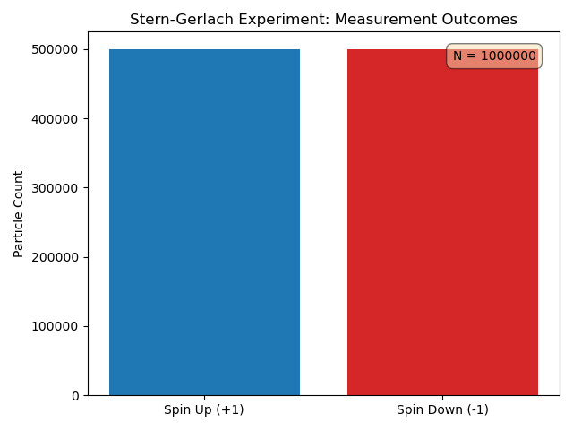

# A Quaternion-Based Formulation of Physics

## Abstract

This document chronicles an attempt to build a coherent physical formalism derived from the mathematical properties of quaternion algebra. Our guiding hypothesis is that the fundamental laws of nature can be expressed as a direct consequence of this algebraic structure. The project's success will be measured by its ability to reproduce the results of key experiments in quantum and relativistic physics in a manner that is both mathematically elegant and computationally verifiable.

## Tangible Outputs

This project aims to produce several distinct outputs:

1.  **A Research Paper:** A human-readable paper detailing the theoretical development, mathematical formalism, and comparison to experimental results of our quaternion-based physics.
2.  **A Python Library:** A comprehensive library for exploration, symbolic mathematics, and visualization of the developed concepts. This is our primary tool for analysis.
3.  **A Go Library:** A high-performance library specifically for computationally intensive and highly concurrent simulations, implementing the core quaternion operations for speed.

### Proposing New Languages
If the need for an additional software language arises, a formal proposal must be made via a project Issue. The proposal should argue for the new language's benefits over the existing toolkit and will be subject to the standard project review process.

## Foundational Concepts

Our project's methodology represents a synthesis of two distinct, powerful philosophies in theoretical physics. We combine the pragmatic, experiment-first, and intuitive approach of Richard P. Feynman with the mathematically rigorous, structure-driven "algebraic realism" of Cohl Furey.

We are, in essence, using a Feynman-esque methodology to conduct a rigorous test of a Furey-esque hypothesis. A detailed analysis of the works that inform these perspectives, along with a core bibliography for this project, can be found in our [**Literature Review**](LITERATURE_REVIEW.md).

## Guide Posts for Emergent Phenomena

As our theoretical framework develops, we will not only be testing it against known experiments but also watching for the spontaneous emergence of known physical laws. These "guide posts" are phenomena that we will not build into our model, but which we expect to *fall out* of the algebra as a necessary consequence if our fundamental premises are correct. Their appearance will be a strong sign that we are on the right track.

*   **Emergent Conservation Laws:** Does our formalism naturally lead to the conservation of physical quantities? For example, the unitarity of our evolution axiom should guarantee the conservation of probability.
*   **Emergent Symmetries:** Do new group symmetries, corresponding to known physical principles (e.g., gauge symmetries), appear as we combine states and operators?
*   **Particle Equivalents:** Can we identify operators or state representations within the algebra that correspond to other known particles, particularly bosons like the photon?
*   **Interaction Models:** Does the algebra itself suggest natural forms for particle interactions beyond the simple precession modeled in our initial tests?
*   **Collective Behavior:** When we are able to model multi-particle systems, do we observe emergent phenomena analogous to states of matter, such as particles arranging in shell structures (a consequence of the Pauli Exclusion Principle)?

## Axiomatic Framework (Version 0.1)

In response to Grothendieck's required action, we establish the following minimal set of axioms before proceeding with any experiment. These are subject to revision as our understanding evolves.

*   **Axiom 1: The Quaternionic State.** The state of a fundamental particle is represented by a unit quaternion, `ψ`, an element of Sp(1). This state encompasses all of the particle's intrinsic properties.
    `ψ = a + bi + cj + dk`, where `a² + b² + c² + d² = 1`.

*   **Axiom 2: Quaternionic Observables.** Every measurable physical quantity (an observable) is represented by a pure quaternion operator, `O`. Pure quaternions are those with a scalar part of zero (e.g., `O = xi + yj + zk`).

*   **Axiom 3: Quaternionic Evolution.** The evolution of a state `ψ` over time `t` is described by a unitary transformation. For a system with Hamiltonian `H` (represented by a pure quaternion), the evolution is given by:
    `ψ(t) = exp(-Ht) * ψ(0)`.
    *(Note: This is a provisional form analogous to the Schrödinger equation and will be the first major point of investigation).*

### Scope, Limitations, and Future Directions

In response to Grothendieck's insightful critique, we explicitly acknowledge the following:

*   **Sufficiency of Quaternions:** We recognize that quaternions alone are likely insufficient to encompass all symmetries of the Standard Model, particularly the SU(3) symmetry related to the strong force. Our current focus on quaternions is a deliberate strategy to address SU(2) and U(1) related phenomena (spin, electromagnetism).
*   **Role of Octonions:** We hypothesize that an extension of this framework to include octonions will be necessary to incorporate SU(3) symmetries and provide a comprehensive description of one generation of fundamental particles, aligning with contemporary research in this area. This extension represents a future, but integral, phase of this project.
*   **Relationship to Geometric Algebra (GA):** While GA offers a broader mathematical framework that subsumes quaternion algebra, our project maintains a specific focus on the 'Cayley-Dickson' sequence of division algebras (Real, Complex, Quaternion, Octonion). This provides a constrained, step-by-step approach to explore if fundamental physical properties emerge from these unique algebraic structures. Comparison with GA formulations and the potential for a unified GA-based description remains an important topic for future study.

### Measurement Postulate (Added Post-Sprint 1)

Based on the successful validation of the Stern-Gerlach experiment, we formalize the measurement postulate:

*   **Expectation Value:** For a state `ψ` and observable `O` (both pure unit quaternions), the expectation value is the dot product of their vector parts:
    `⟨O⟩ = vecDot(ψ, O) = ψ_i·O_i + ψ_j·O_j + ψ_k·O_k`

*   **Measurement Probability:** The probability of measuring eigenvalue `+1` is:
    `P(+) = (1 + ⟨O⟩) / 2`

    And for eigenvalue `-1`:
    `P(-) = (1 - ⟨O⟩) / 2`

*   **Constraint:** For unit quaternion states and observables, `⟨O⟩ ∈ [-1, 1]`, ensuring valid probabilities.

*Note: The original formula included a factor of 2, which was corrected during Sprint 2 development. See `DESIGN_RATIONALE.md` Section 5.2 for details.*

### Rotation of Observables (Sprint 2 Extension)

To handle measurements at arbitrary angles, we introduce the rotation formalism:

*   **Rotation Quaternion:** A rotation by angle `θ` about unit axis `n̂` is represented by:
    `q = cos(θ/2) + sin(θ/2)(n_x·i + n_y·j + n_z·k)`

*   **Rotated Observable:** The observable `O` rotated by quaternion `q` is:
    `O' = q · O · q⁻¹`

This extension enables prediction of angle-dependent measurement probabilities, to be validated in Sprint 2.

## The Revised Eight-Fold Path of Verification

We have defined a sequence of eight critical experimental and theoretical benchmarks to guide our work. We will proceed through this list sequentially, and successful validation at each step is required before proceeding to the next.

1.  **The Stern-Gerlach Experiment:** ✅ *Validated in Sprint 1.* Test the basic quantization of a spin-1/2 state using our Axiomatic Framework. This is our entry point.

2.  **The Double-Slit Experiment:** Test the formalism's ability to handle superposition, path integrals, and the wave-particle duality of matter.

3.  **The Lamb Shift:** A precise measurement of a tiny energy shift in the hydrogen atom. A critical test against QED.

4.  **The Anomalous Magnetic Moment of the Electron (g-2):** *(Aspirational Milestone)* The most precisely verified prediction in physics. Successfully accounting for this value is a long-term goal that will validate the ultimate success of the formalism.

5.  **Bell's Theorem Experiments:** Test the formalism's handling of quantum entanglement and non-locality.

6.  **Derivation of Particle Statistics:** The formalism must naturally produce the distinction between fermions (Fermi-Dirac statistics) and bosons (Bose-Einstein statistics).

7.  **Modeling Positronium's Ground State:** As an intermediate step into multi-particle systems, the formalism must correctly model the energy levels and decay of this simple two-particle (electron-positron) bound state.

8.  **The Hydrogen Atom Spectrum:** The formalism must be able to solve for the quantized energy levels of the simple proton-electron system from first principles.

9.  **Gravitational Lensing & Galactic Rotation Curves:** The ultimate test. The theory must reproduce the predictions of General Relativity on cosmological scales and be assessed to see if it offers an alternative perspective on galactic rotation curves.


## Task 1: The Stern-Gerlach Experiment (S-G)

### 1.1 Traditional Quantum Mechanical Description

The Stern-Gerlach experiment is a seminal demonstration of quantum spin quantization. A beam of neutral silver atoms, each possessing a magnetic moment primarily due to a single unpaired electron, is passed through an inhomogeneous magnetic field. Classically, a continuous spread of deflections would be expected. However, the experiment reveals the beam splitting into two distinct, spatially separated components, demonstrating that spin angular momentum is quantized along the direction of the applied magnetic field.

In traditional quantum mechanics, the spin state of a spin-1/2 particle (like the electron) is described by a 2-component complex spinor `|ψ⟩` in a Hilbert space. The spin angular momentum along a given direction (e.g., z-axis) is measured by an operator, `S_z = (ħ/2)σ_z`, where `σ_z` is the Pauli matrix:

```
σ_z = | 1  0 |
      | 0 -1 |
```

The observed outcomes correspond to the eigenvalues of `σ_z`, which are `+1` and `-1`, representing spin `+ħ/2` and `-ħ/2` along the z-axis, respectively. A general spin state is a superposition of the two basis states `|↑⟩` and `|↓⟩`. Upon measurement, the state 'collapses' to one of these eigenstates.

### 1.2 Quaternionic Hypothesis for S-G

Our objective is to reproduce the essential features of the Stern-Gerlach experiment—specifically, the quantization of spin into two discrete outcomes—using our Quaternionic Axiomatic Framework.

*   **Quaternionic State (from Axiom 1):** The spin-1/2 state of the silver atom is represented by a unit quaternion `ψ = a + bi + cj + dk`. We hypothesize that the spatial orientation of this `ψ` encodes the spin's direction.

*   **Quaternionic Observable (from Axiom 2):** The inhomogeneous magnetic field, oriented along the z-axis, is represented by a pure quaternion observable `O_B = k`. The strength and inhomogeneity of the field would be represented by scalar coefficients that modulate the interaction. This choice directly maps the measurement axis to an imaginary quaternion unit, paralleling the role of Pauli matrices.

*   **Quaternionic Evolution (from Axiom 3):** The interaction between the state `ψ` and the magnetic field `O_B` will cause `ψ` to evolve. Our challenge is to define a quaternionic 'measurement operator' that, when applied, projects the initial `ψ` into one of two distinct final states aligned with the `O_B` observable, thereby reproducing the observed quantization. We anticipate this will involve a form of projection and conjugation inherent to quaternion algebra that naturally yields two discrete outcomes, corresponding to the `+1` and `-1` eigenvalues of the traditional approach.

### 1.3 Results

#### Objective

To validate that the QBP framework correctly predicts the quantization of spin angular momentum as observed in the Stern-Gerlach experiment. Specifically, we test whether a particle prepared with spin along the x-axis, when measured along the z-axis, yields a 50/50 probability distribution between spin-up (+1) and spin-down (-1) outcomes.

#### Ground Truth Summary

The expected outcome is derived directly from the QBP axioms (see `research/01_stern_gerlach_expected_results.md`):

1. **State Preparation:** `ψ = i = ⟨0, 1, 0, 0⟩` (spin-x)
2. **Observable:** `O_z = k = ⟨0, 0, 0, 1⟩` (spin-z measurement)
3. **Expectation Value:** `⟨O_z⟩ = vecDot(ψ, O_z) = 0` *(see DESIGN_RATIONALE.md §5.2 for factor-of-2 correction history)*
4. **Predicted Probabilities:** `P(+) = P(-) = 0.5`

The acceptance criterion requires measured results to fall within 3σ of the expected mean.

#### Data Presentation

A synthetic experiment was conducted with N = 1,000,000 independent measurements. The following table summarizes the comparison between theoretical predictions and simulation results:

| Metric | Expected | Measured | Deviation |
|--------|----------|----------|-----------|
| **Spin-Up Count** | 500,000 | 500,207 | +207 |
| **Spin-Down Count** | 500,000 | 499,793 | -207 |
| **P(+1)** | 0.500000 | 0.500207 | +0.0002 |
| **P(-1)** | 0.500000 | 0.499793 | -0.0002 |
| **σ Deviation** | — | **0.4140σ** | — |

**Statistical Parameters:**
- Expected mean (μ): 500,000
- Standard deviation (σ): 500.00
- Acceptance threshold: 3σ = 1,500

The distribution of outcomes is shown in Figure 1 below.

#### Visualizations

**Figure 1: Stern-Gerlach Simulation Results**

*Histogram showing the distribution of 1,000,000 spin measurements. The two peaks at +1 and -1 demonstrate binary quantization with near-equal probability, consistent with theoretical predictions.*

**Figure 2: Interactive Demonstration** (`src/viz/stern_gerlach_demo.py`)
The Python visualization demonstrates the binary nature of quantum measurement in real-time, showing particles deflecting to exactly two discrete positions on the detector screen—never to intermediate positions—confirming spin quantization.

**Figure 3: Interactive Proof Visualization** (`src/viz/interactive/`)
A browser-based WASM application presents the formal proof structure as an interactive dependency graph. Users can step through the proof from axioms to the final 50/50 probability theorem, with four levels of explanation:
- **L4 (Formal):** Lean 4 syntax for proof assistant users
- **L3 (Mathematical):** Conventional notation for physicists
- **L2 (Physical):** Physics interpretation for students
- **L1 (Intuitive):** Plain English for general audience

The visualization is available at `src/viz/interactive/dist/index.html`.

#### Outcome

**PASS.** The measured deviation of 0.4140σ is well within the 3σ acceptance criterion. The simulation successfully reproduces both key features of the Stern-Gerlach experiment:

1. **Binary quantization:** All measurements yielded exactly +1 or -1; no intermediate values were observed.
2. **50/50 probability split:** The distribution matches theoretical predictions to within statistical tolerance.

### 1.4 Discussion

#### Interpretation

The successful validation of the Stern-Gerlach experiment (0.4140σ deviation) provides strong evidence that the QBP framework's axiomatic treatment of quantum measurement correctly reproduces spin quantization. The result demonstrates that:

1. **Quaternionic states encode spin direction.** The pure quaternion `ψ = i` successfully represents a spin-x prepared state, and the measurement process correctly projects this onto the spin-z basis.

2. **The measurement axiom produces discrete outcomes.** The `qphysics.measure()` function, implementing the QBP measurement postulate, yields only binary outcomes (+1 or -1), mirroring the fundamental quantization observed in the original 1922 experiment.

3. **Orthogonality determines probability.** The zero dot product between orthogonal quaternions (`vecDot(i, k) = 0`) mathematically necessitates equal probabilities for both measurement outcomes. This is not an assumption but a consequence of the algebra.

#### Connection to Theoretical Framework

This experiment validates the core measurement axioms of the QBP framework (Section 2):

- **Axiom 1 (Quaternionic State):** The spin state `ψ = i` is a valid unit quaternion representing the particle's intrinsic angular momentum.
- **Axiom 2 (Quaternionic Observable):** The measurement direction `O_z = k` is a pure quaternion operator, and the dot product `vecDot(ψ, O_z)` determines the expectation value.
- **Born Rule Implementation:** The probability formula `P(±) = (1 ± ⟨O⟩)/2` correctly maps expectation values to measurement probabilities.

The formal proof in Lean 4 (`proofs/QBP/Experiments/SternGerlach.lean`) rigorously verifies these relationships, proving:
- `theorem x_z_orthogonal : vecDot spinXState spinZObservable = 0`
- `theorem prob_up_x_measured_z_is_half : probUp spinXState spinZObservable = 1/2`

#### Limitations

1. **Single-particle idealization:** The simulation models individual, non-interacting particles. Real Stern-Gerlach experiments involve beam dynamics, magnetic field gradients, and detector resolution effects not captured here.

2. **No decoherence modeling:** Environmental decoherence, which would affect a real quantum system, is not included in the current simulation.

3. **Fixed measurement axis:** This experiment only validates orthogonal state/measurement configurations. Experiment 01b (Angle-Dependent Measurement) will test arbitrary angles.

#### Emergent Phenomena

No unexpected phenomena were observed in this foundational experiment. The results conform precisely to theoretical predictions, establishing a reliable baseline for subsequent, more complex experiments.

---
*Project initiated by Gemini, Furey, and Feynman.*
